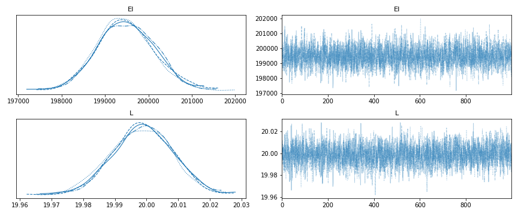
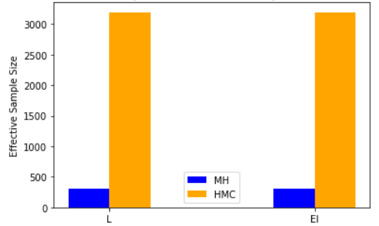

---
title:
- A Modern Bayesian Approach to Model Updating of Bridges Considering Measurement Uncertainty
header-includes:
- |
    ```{=latex}
    %\setbeameroption{hide notes} % Only slides
    %\setbeameroption{show only notes} % Only notes
    \AtBeginSection[] { \begin{frame} \frametitle{Contents} \tableofcontents[currentsection] \end{frame} }
    \DeclareMathOperator*{\argmax}{\arg\max}

    \usepackage{tikz}
    \logo{\includegraphics[width=1.5cm]{figs/MonashLogo.pdf}}
    \usepackage{caption}
    \captionsetup[figure]{font=small}
    ```
author:
- Ms Fatemeh Shaker
- A/Prof. Colin Caprani
institute: 
- Monash University
date:
- July 2023
theme:
- Frankfurt
section-titles: false
toc: false 
fontsize: 11pt
urlcolor: blue
linkstyle: bold
aspectratio: 169
---


# Overview

## Why Finite Element Model Updating?

- Uncertainties

- Model error

- Structural health monitoring (SHM) data 

::: notes
- If we had perfect knowledge, we would not need updating

- We are trying to guide good decisions
:::

## Bayesian Inference

- Prior
- Data
- Likelihood
- Posterior

::: columns

:::: column
&nbsp;&nbsp;&nbsp;&nbsp;&nbsp;&nbsp;&nbsp;

<!-- Equation -->
$$
P(\theta \mid data) = \frac{P(data \mid \theta)P(\theta)}{P(data)}
$$

<!-- Equation -->
$$
p(\text{data}) = {\int p(\text{data}|\theta) \cdot p(\theta) \ d\theta}
$$

::::

:::: column

{height=3cm}

::::

:::


# Determining of Posterior Distribution

## Bayesian is hard because integration is hard!
Closed-form Solution (conjugate priors)

&nbsp;&nbsp;&nbsp;&nbsp;&nbsp;&nbsp;&nbsp;

{height=4cm}

## Sampling Methods
- Metropolis-Hasting Algorithm 
  - Moves to a new near state randomly!


{height=3cm}

## Sampling Methods
- Hamiltonian Monte Carlo (HMC)
  - Using the geometry of the log-likelihood model, momentum, and gradient!


{height=3cm}

## Diagnostic and Convergence
Gelman Rubin statistic
<!-- Equation -->
$$
\hat{R}=\sqrt{\frac{N-1}{N}+\frac{1}{N} \frac{B}{W}}
$$

{height=4.5cm}

## Effective Sample Size
MH may get Stuck!

{height=4cm}

## Principled Bayesian Workflow Using HMC

{height=6cm}

# Application 

## Application

::: columns

:::: column

Simple Beam with Moving Point Load 

{height=3.5cm}

::::

:::: column
$$\label{eq:deflection}
\begin{split} 
% note use of virtual dot delimiters \left. and \right. to close the brackets over multilines to avoid complilation error. Alignment & needs to be outside delimiters.
 \delta = \frac{PL^3}{6EI}  \left[ a^3(1-x) \right. &- \langle a-x\rangle^3 \\
&\left. +  a(1-x)^3 - a(1-x) \right]
\end{split}$$
::::

:::
## Function and data results plot for deflection
{height=6cm}

## Prior distributions and probabilistic model structure

::: columns

:::: column

.png){height=6cm}

::::

:::: column
{height=3cm}
::::

:::

## Prior predictive check
.png){height=5cm}

## Posterior density and trace plots of each chain
{height=6cm}

## Posterior density and trace plots of each chain
{height=6cm}

## Comparing Results
::: columns

:::: column

Diagnostic and Convergence ($\hat{R}$) 

| **Parameter** | **HMC** | **MH**  |
|:--------------|:-------:|:-------:|
|      EI       |    1    |   1.03  |
|       L       |    1    |   1.01  |

::::

:::: column
{height=4cm}
::::

:::

## Posterior plots (calculate highest density interval (HDI))
The wider HDI from HMC suggests that it might be better at capturing the tails of the posterior distribution, where less probable but still plausible values reside.

\

::: columns

:::: column

{height=4cm}

::::

:::: column

{height=4cm}

::::

:::

# Summary
## Conclusion
- Recent developments in Bayesian methods can help structural engineers improve model updating.
- HMC sampling allows flexibility with non-conjugate distributions and can have important diagnostics. 
- Prior and posterior predictive checks validate the model and provide accurate parameter estimates.
- The updating procedure was done without any user input settings hyperparameters for HMC.
- The updated model with posterior parameter distributions can better predict the uncertain real structure behaviour.

## Thank You!

- Thank you for your kind attention

- Please email me at [Fatemeh.Shaker@monash.edu](mailto:Fatemeh.Shaker@monash.edu) with any thoughts on this


